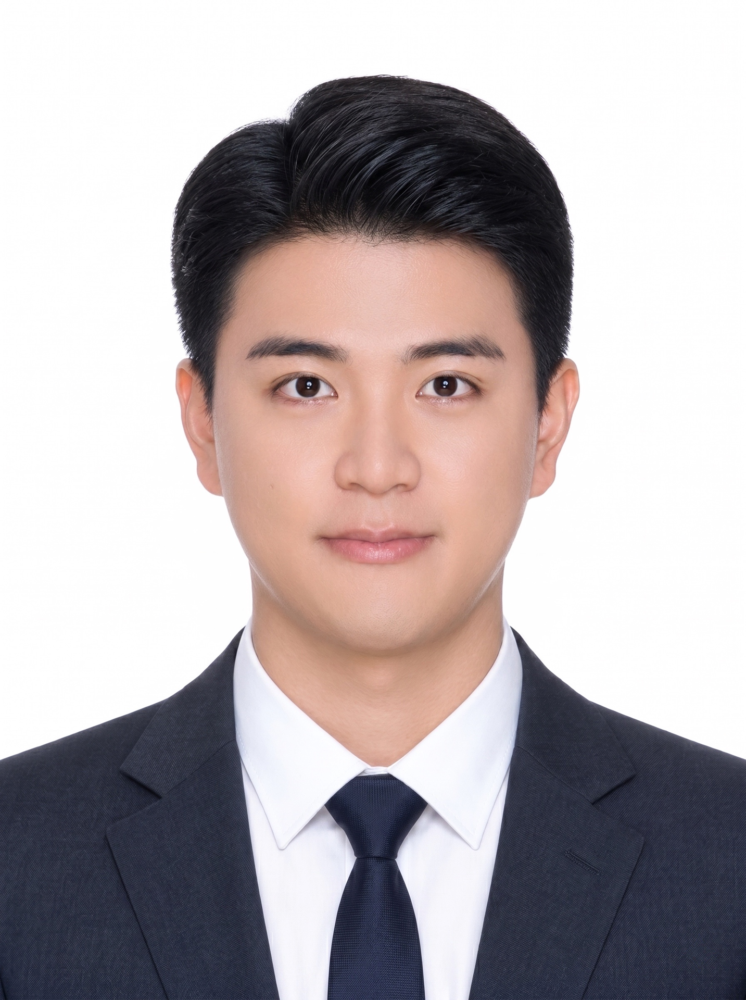

# 김강민 · Kim KangMin

### 문제를 끝까지 구조화하고, 실제로 작동하는 소프트웨어로 답합니다.

대한민국 육군 장교로서 쌓은 책임감과 실행력을 바탕으로 
사용자의 문제를 기술로 해결하는 소프트웨어 개발자를 향해 나아가고 있습니다.

---

## About Me

<table>
  <tr>
    <td width="220" align="center" valign="top">
      
    </td>
    <td valign="top">
      <strong>김강민 · Kim KangMin</strong>  
      6년간 대한민국 육군 장교로 복무하며 다양한 구성원과 협업하고, 제한된 환경에서도 우선순위를 판단해 임무를 완수하는 법을 배웠습니다. 이제 그 경험을 소프트웨어 개발에 연결하여, 문제의 본질을 파악하고 사용자가 실제로 활용할 수 있는 결과물을 만드는 개발자로 성장하고 있습니다.
        
      <ul>
        <li>새로운 기술을 빠르게 학습하고 직접 구현하며 이해합니다.</li>
        <li>기능 구현에 그치지 않고 사용성, 안정성, 보안과 운영 환경까지 함께 고민합니다.</li>
        <li>복잡한 문제를 작은 단위로 나누고, 검증 가능한 결과로 완성합니다.</li>
      </ul>
    </td>
  </tr>
</table>

## Activity & Education

| 기간 | 소속 및 활동 |
| :---: | --- |
| **2016.03 – 2020.02** | 광운대학교 컴퓨터소프트웨어학과 |
| **2020.03 – 2026.06** | 대한민국 육군 대위 |
| **2026.07 – 현재** | **삼성 청년 SW·AI 아카데미(SSAFY) 16th** |

## Awards

| 수상일 | 수상 내역 | 수여 기관 |
| :---: | --- | --- |
| **2019.11.08** | 졸업작품 전시회 우수상 | 광운대학교 컴퓨터소프트웨어학과 |

## Tech Stack

### Programming Language

### Framework & Library

## Projects

### [!WEARy](https://github.com/77romin/weary)

> 매일의 착장을 기록하고 옷의 활용도 확인, 스타일 공유와 중고거래까지 연결하는 iOS 패션 플랫폼

- 옷장 관리, 착장 기록, 패션 커뮤니티와 중고거래를 하나의 사용자 흐름으로 구현
- Apple Vision을 이용한 배경 제거와 온디바이스 착장 후보 추천
- SwiftData 로컬 저장과 Supabase 공개 데이터 저장을 분리한 로컬 우선 구조
- PostgreSQL RLS·RPC·Trigger를 활용한 서버 권한 및 데이터 보호

`SwiftUI` `SwiftData` `Apple Vision` `Supabase` `PostgreSQL` `Realtime`

---

### [minstock](https://github.com/77romin/minstock)

> 여러 증권사의 국내·미국주식 자산을 하나의 터미널에서 조회하는 Go 기반 포트폴리오 TUI

- NH투자증권과 키움증권의 서로 다른 응답을 공통 도메인 모델로 통합
- 캐시 우선 로딩과 점진적 갱신을 통해 빠른 첫 화면 제공
- 주문 기능을 배제하고 조회 API allowlist와 OS 키링을 적용한 안전 경계 설계
- 종목 검색, 캔들 차트, 이동평균선, 관심종목과 규칙 기반 분석 제공

`Go` `Bubble Tea` `SQLite` `REST API` `OAuth` `go-keyring`

---

### [Gospel Choir Practice · 항해자](https://github.com/77romin/gospel.letsgomin)

> 성가대원이 자신의 파트를 듣고 지휘자가 지정한 구간을 반복 연습하는 웹 연습실

- 합창·소프라노·알토·테너·바리톤 파트별 음원 연습 기능
- Web Audio 예약 재생을 이용한 여러 기기의 공동 시작·정지 동기화
- 지휘자의 연습 구간 생성·수정·강조·완료 관리 기능
- 데스크톱과 모바일을 지원하는 반응형 연습 화면

**[서비스 바로가기](https://gospel.letsgomin.com/)** · `JavaScript` `HTML5` `CSS3` `Web Audio API` `WebSocket` `Supabase`

---

### [LocalHub](https://github.com/77romin/localhub)

> 공공 관광 데이터에 지역 커뮤니티와 근거 기반 AI 안내를 연결한 대전·충청 로컬 플랫폼

- 한국관광공사 TourAPI의 8개 콘텐츠 유형과 1,365건의 지역정보 통합
- 장소 중심 익명 게시글·댓글·좋아요 커뮤니티 구현
- SQLite 공개 데이터만 문맥으로 사용하고 서버가 인용을 조립하는 AI 검색 경계 설계
- Vue 기반 프런트엔드와 FastAPI 백엔드를 연결한 풀스택 프로젝트

`Vue.js` `FastAPI` `Python` `SQLite` `OpenAI Responses API`

---

### [Intelligent Traffic Signal](https://github.com/77romin/CapstoneProject2019)

> Raspberry Pi와 객체 탐지를 이용해 교차로의 차량 대기시간을 줄이는 지능형 교통 신호 시스템

- Raspberry Pi 카메라 영상에서 YOLOv3로 도로별 차량 수 인식
- 인식 결과를 서버로 전달해 교통량에 따라 신호 정책 조정
- Unity 환경에서 시간대별 차량·보행자 흐름 시뮬레이션
- 직접 라벨링한 차량 이미지 1,030개를 이용해 탐지 모델 학습

`Python` `YOLOv3` `OpenCV` `Raspberry Pi` `Java` `Unity` `C#`

---

### [VQA Performance Enhancement](https://github.com/77romin/vqa-enhancement)

> VQA 모델의 데이터·학습 목표·추론 방식을 분석하고 개선한 AI 실험 프로젝트

- 학습 데이터 사용 범위와 중복 이미지 분할 방식 개선
- 프롬프트 전체가 아닌 정답 구간에 집중하도록 loss masking 수정
- 자유 생성 대신 선택지별 conditional log-probability 비교 방식 적용
- 사용자 제공 Kaggle 결과 기준 정확도 **0.70837 → 0.95829** 개선

`Python` `PyTorch` `Transformers` `LoRA` `VQA` `Computer Vision`

## Certificates

| 자격 및 어학 | 취득·합격일 |
| --- | :---: |
| 데이터분석 준전문가 **ADsP** | 2026.06.05 |
| SQL 개발자 **SQLD** | 2026.06.19 |
| 한국사능력검정시험 **1급** | 2015.06.09 |
| 정보처리기사 **필기 합격** | 2026.09.09 |
| **OPIc IM1** | — |

## Language

- **Korean** — Native
- **English** — OPIc IM1

---

### Learn, Build, Verify, Improve.

